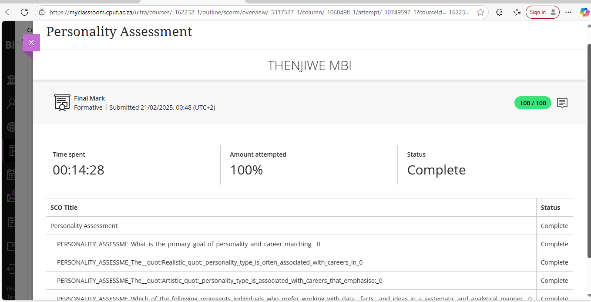
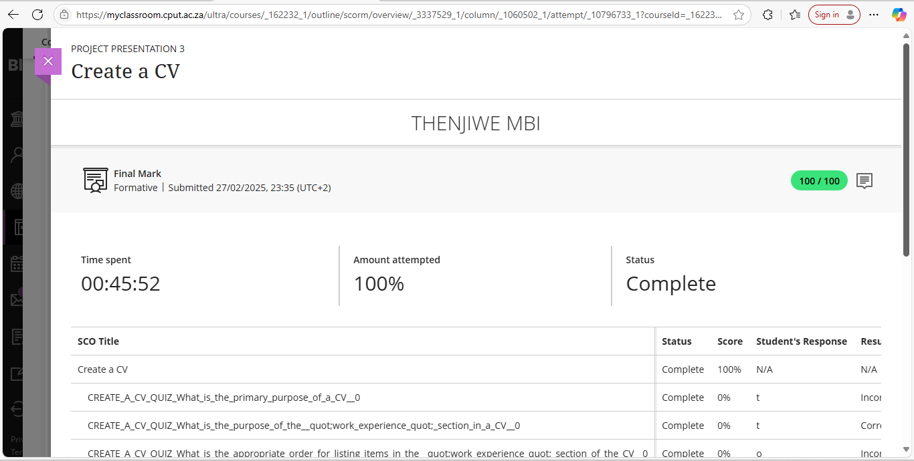
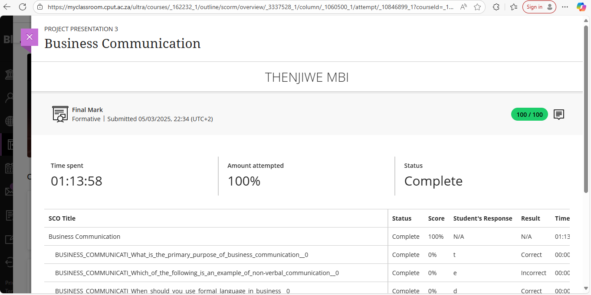
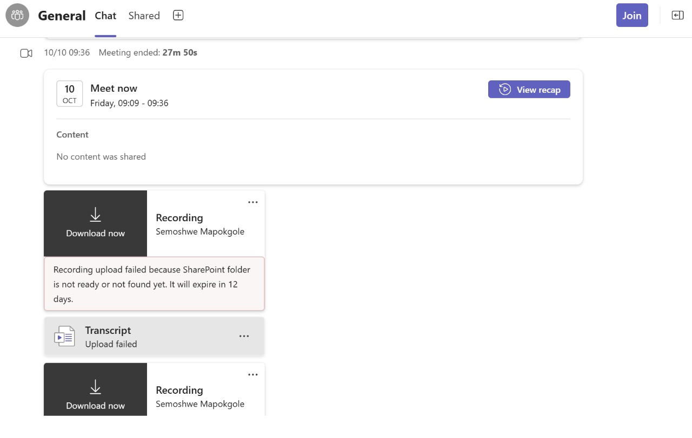
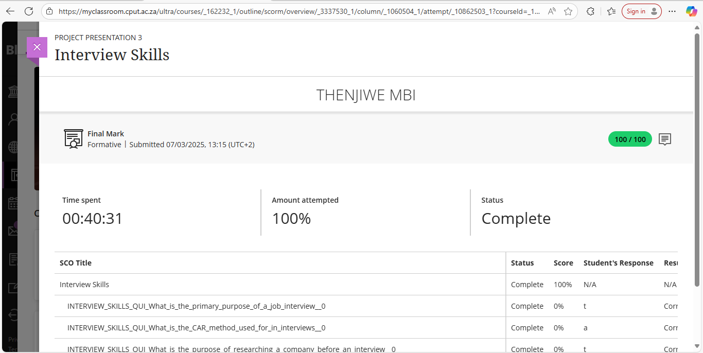
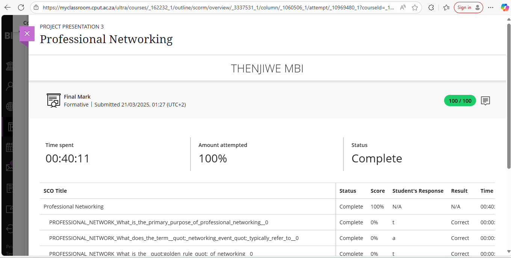

# Thenjiwe-Portfolio
The work readiness training
# Overview 
This portfolio shows my experience learning from the Work Readiness Training 
## Career Development
)](https://github.com/Thenjiwe-prp/Thenjiwe-Portfolio/blob/main/Skills%20and%20Interest.png?raw=true](https://github.com/Thenjiwe-prp/Thenjiwe-Portfolio/blob/main/Career%20Development.png?raw=true))
## Reflection(STAR)
- **S**ituation:Engaged in a seassion to explore career pathways to prepare for WIL
- **T**ask: Identify a career aligning with my goals
- **A**ction: Completed career development self-assessment
- **R**esults: Gained more clarity in pursuing a career in Software Development
## Skills and Interests 
)](https://github.com/Thenjiwe-prp/Thenjiwe-Portfolio/blob/main/Skills%20and%20Interest.png?raw=true)
## Reflection(STAR)
- **S**ituation: Knowing my skills and interest 
- **T**ask: Understanding more about core values that they are highly personal principles that give meaning to caree and life 
- **A**ction: Completed skills and interest self-assessment
- **R**esults: Gained more guidence in my decision and letting my values be my internal compass
## Personality Assessment 
](https://github.com/Thenjiwe-prp/Thenjiwe-Portfolio/blob/main/Career%20Development.png?raw=true)](https://github.com/Thenjiwe-prp/Thenjiwe-Portfolio/blob/main/Personality%20Assessment.png?raw=true)
## Reflection(STAR)
- **S**ituation: Finding a siutable career that align with my personality
- **T**ask: Identify my personality type
- **A**ction: Completed a personal assessment self-assessment
- **R**esults: I am Investigative which mean i enjoy thinking intellectually and solving problems
## Creat A CV 
](https://github.com/Thenjiwe-prp/Thenjiwe-Portfolio/blob/main/Create%20a%20CV.png?raw=true)
## Reflection(STAR)
- **S**ituation: Required to create a professional CV
- **T**ask: Draft a clear and appealing resume
- **A**ction: Completed creat a cv self-assessment
- **R**esults: Created a finalized job-ready CV
## CV Submission 
**[CV Submission.pdf](https://github.com/Thenjiwe-prp/Thenjiwe-Portfolio/blob/main/My%20CV-merged.pdf)**
## Reflection(STAR)
- **S**ituation: Submitted a CV for WIL
- **T**ask: Ensure readiness for job application
- **A**ction: Submitted the reviewed final version
- **R**esults: More confident about job readiness
## Business Communication
](https://github.com/Thenjiwe-prp/Thenjiwe-Portfolio/blob/main/business%20communication.png)
](https://github.com/Thenjiwe-prp/Thenjiwe-Portfolio/blob/10d191fd8128d7dc3b3a1d7b56f681191ce889ab/proof.png?raw=true)
## Reflection(STAR)
-**S**ituation: Knowing a more about business communicstion.
-**T**ask: Understanding more about business communication to help build your caree.
-**A**ction: Complete Business Communication self-assessment.
-**R**esults: More confident about business communication.
## Interview Skills
](https://github.com/Thenjiwe-prp/Thenjiwe-Portfolio/blob/main/interview%20skills.png)
## Reflection(STAR)
-**S**ituation: Knowing interview skils.
-**T**ask: Unsure readiness for business interview.
-**A**ction: Complete interview skills self-assessment.
-**R**esults: more confident about Interviews.
## Mock Interview

## Reflection(STAR)
-**S**ituation: Doing a interview video.
-**T**ask: Create appealing interview video .
-**A**ction: Complete a video interveiw video.
-**R**esults: Ready for a job interview.
## Professional Networking
](https://github.com/Thenjiwe-prp/Thenjiwe-Portfolio/blob/main/professional%20networking.png)
](https://github.com/Thenjiwe-prp/Thenjiwe-Portfolio/blob/main/professional%20networking.png)
## Reflection(STAR)
-**S**ituation: Knowing more about networking in my caree path.
-**T**ask: Ensure readiness for networking.
-**A**ction: Complete a professional networking self-assessment.
-**R**esults: More confident about networking.
# Workplace Atiquette
](https://github.com/Thenjiwe-prp/Thenjiwe-Portfolio/blob/main/workplace%20etiquette.png)
## Reflection(STAR)
-**S**ituation: Knowing more about workplace atiquette.
-**T**ask: Ensure readiness for workplace.
-**A**ction: Complete a workplace atiquette self-assessment.
-**R**esults: Ready for a workplace atiquette.
